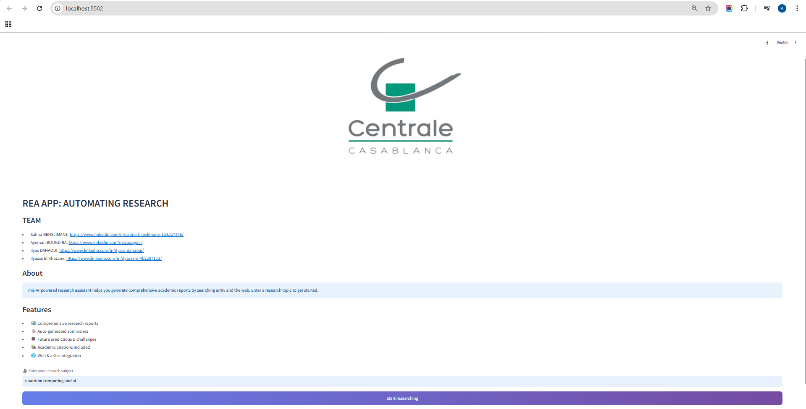
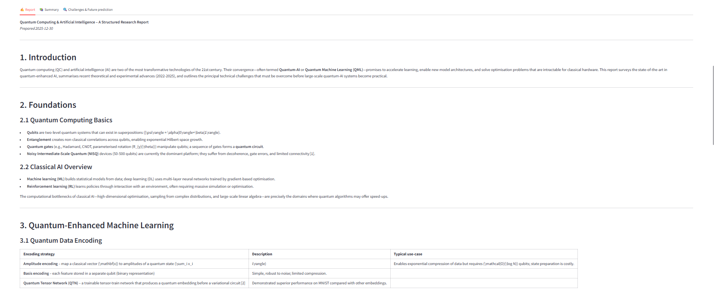
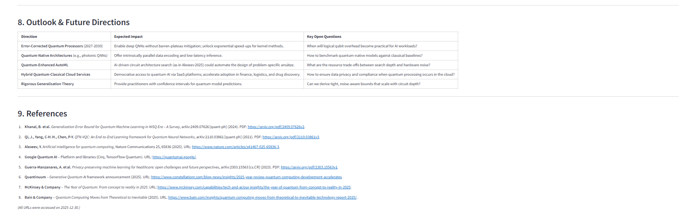
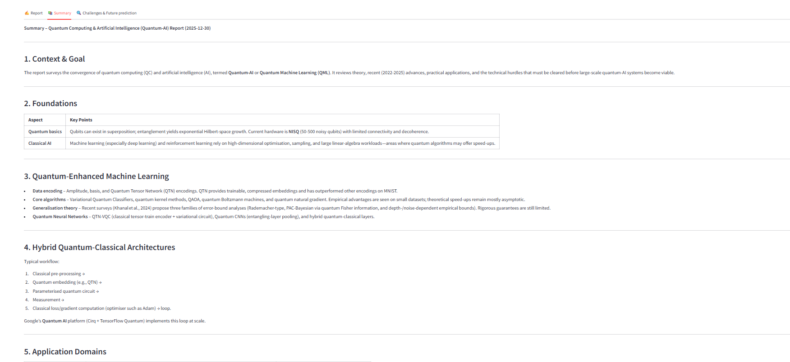
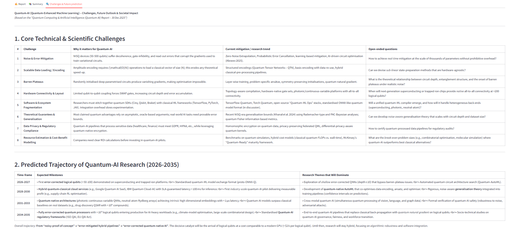

# REA APP: Research Expert Assistant

## 👥 Team
- Salma BENSLIMANE
- Ayeman BOUGDIRA
- Ilyas DAHAOUI
- Ilyasse El Khazane

**REA APP** (Research Expert Assistant) is an AI-powered research platform designed to automate the generation of comprehensive academic reports. By leveraging multi-agent logic and specialized search tools, the application streamlines the process of gathering, summarizing, and analyzing scientific data.

## 🚀 Key Features

* **Comprehensive Research Reports**: Automatically generates detailed reports using a specialized research assistant.
* **Integrated Search Tools**: Combines scientific data from **arXiv** and general web information from **Tavily**.
* **Auto-Generated Summaries**: Produces concise versions of long-form reports for quick reading.
* **Future Predictions & Challenges**: Analyzes topics to predict future research trends and societal impacts.
* **Academic Citations**: Ensures all findings include relevant source links and references.

## 🛠️ Architecture

The project is built using a modular Python architecture:
* **`agents.py`**: Contains the core logic for the research agent, utilizing the `gpt-oss-120b` model via OpenRouter to handle tool-calling and reasoning.
* **`research_api.py`**: Defines the integration with external APIs, including XML parsing for arXiv and structured search via Tavily.
* **`interface.py`**: A Streamlit-based dashboard that provides a user-friendly interface for starting research tasks and viewing results in tabs.

## 🧑‍💻 User interface








## 🔧 Setup & Installation

### 1. Prerequisites
Ensure you have the following API keys available:
* **OpenRouter API Key**: For LLM access.
* **Tavily API Key**: For web search capabilities.

### 2. Installation
```bash
# Install required dependencies
pip install streamlit requests openai tavily-python

setx OPENROUTER_API_KEY "YOURGPTOSS120BAPI"

$env:OPENROUTER_API_KEY="YOURGPTOSS120BAPI"

# run the app

streamlit run interface.py


